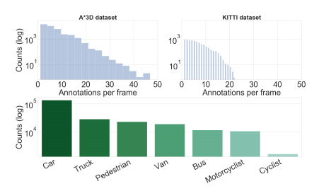
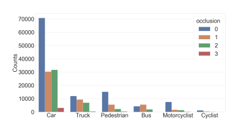
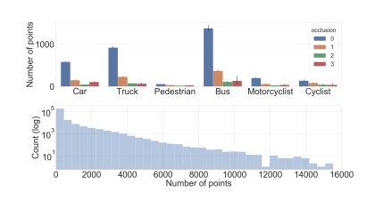
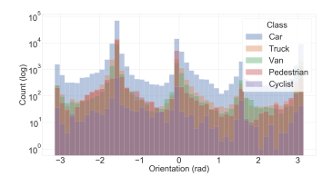
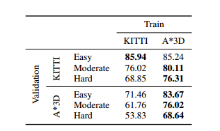
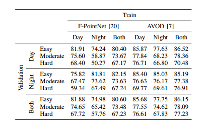

# A*3D: An Autonomous Driving Dataset in Challeging Environments

A*3D dataset is a step forward to make autonomous driving safer for pedestrians and the public in the real world.

- 230K human-labeled 3D object annotations in 39,179 LiDAR point cloud frames and corresponding frontal-facing RGB images.
- Captured at different times (day, night) and weathers (sun, cloud, rain).

[comment]: <> (The following demonstrates the comparison with existing multi-modal Autonomous Driving datasets.)

## Video Demonstration

<div align="center">
   <iframe width="560" height="315" src="https://www.youtube.com/embed/9LjFbnIvzwg" frameborder="0" allowfullscreen>
   </iframe>
</div>

Please click the following .gif and get ready to be directed to the video demonstration of our dataset !

[](https://www.youtube.com/watch?v=9LjFbnIvzwg)

Night-time high-density examples from the proposed A*3D dataset with RGB images and their corresponding LiDAR data. 

<div align=center></div>

## Sensor Setup
We collect raw sensor data using the A*STAR autonomous vehicle, which is equipped with the following sensors:
  - Two PointGrey Chameleon3 USB3 Global shutter color cameras (CM3-U3-31S4C-CS) with 55Hz frame rate, 2048 × 1536 resolution.
  - A Velodyne HDL-64ES3 3D-LiDAR with 10Hz spinrate, 64 laser beams.
  
The following depicts the Sensor setup for A*3D data collection vehicle platform. 
  <div align=center></div>
  
## Data Collection
- The data collection covers **the entire Singapore** including highways, neighborhood roads, tunnels, urban, suburban, industrial, HDB car parks, coastline, etc. 
- NuScenes only covers a small portion of Singapore roads (highlighted in red).

  <div align=center></div>

## Dataset Statistics
- **17% frames with high object-density**. 
	- The number of annotations per frame for A*3D dataset are much **higher than KITTI dataset**.
	- The A*3D dataset comprises **7 annotated classes** corresponding to the most common objects in road scenes.

<div align=center></div>

- **25% frames with heavy occlusion**. 
	- About half of the vehicles are partially or highly occluded.
	<div align=center></div>

	- Average number of points inside the bounding box of each class and the Log number of points within bounding box.
  	<div align=center></div>
	
- Radial distance.
  	<div align=center></div>

- Distribution of object orientation.
  	<div align=center></div>

- Box dimensions.
  	<div align=center></div>


## Benchmarking
- Object-density: Cross-dataset Evaluation
  - A pre-trained model of PointRCNN on KITTI suffers almost a 15% drop in mAP on A*3D validation set. 
  - When trained on our high-density subset, PointRCNN achieves much better performance on the KITTI validation set, especially on Moderate and Hard with almost 10% improvements.
   <div align=center></div>
   
- High object-density vs. Low object-density
  - When increasing the training data, the performance improvements are marginal.
  - The best result comes from mixing high and low density samples.
    <div align=center></div>

- Day-time vs. Night-time
  - We are the first to provide a systematic study on the effects of night-time on 3D object detection systems with F-PointNet and AVOD methods. 
    <div align=center></div>

## Download A*3D dataset
Please email Jie Lin (lin-j@i2r.a-star.edu.sg) for the download link to the dataset. Note that this dataset is for non-commercial research purposes only. A Non-Commercial Use Agreement needs to be signed.

## Citation
If using our data in your research work, please cite the following paper:
```
@article{astar-3d,
	author = {Quang-Hieu Pham, Pierre Sevestre, Ramanpreet Singh Pahwa, Huijing Zhan, Chun Ho Pang, Yuda Chen, Armin Mustafa, Vijay Chandrasekhar, Jie Lin},
	title = {A*3D Dataset: Towards Autonomous Driving in Challenging Environments},  
	year = {2019},
	eprint = {1909.07541}
}
```
