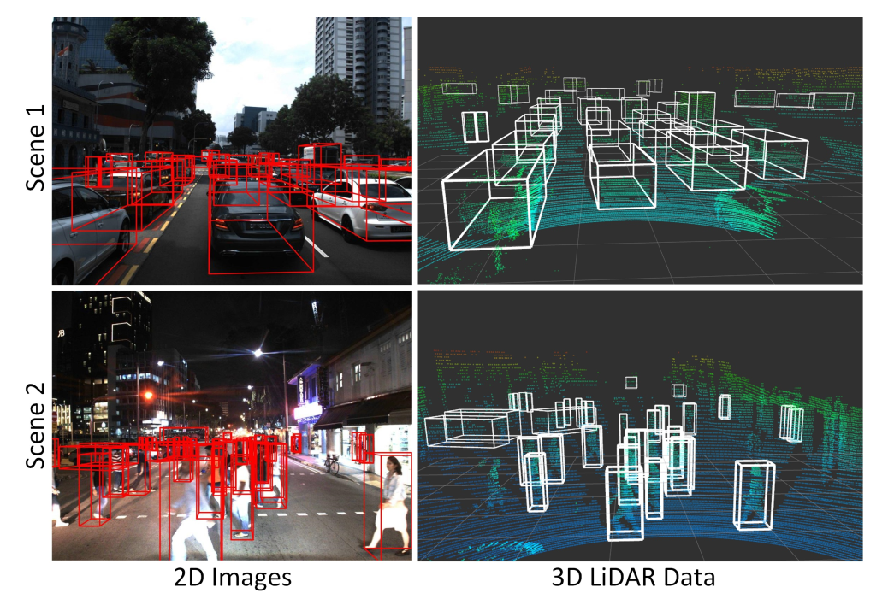
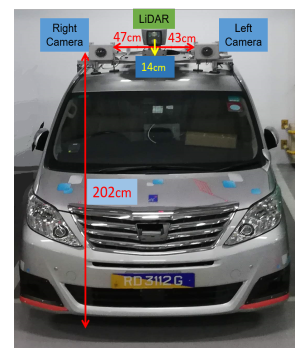

# A*STAR 3D
An Autonomous Driving Dataset from I2R, A*STAR

- **Night-time high-density** Examples from the proposed A*3D dataset with RGB images and their corresponding LiDAR data. 

- We collect raw sensor data using the A*STAR autonomous vehicle, which is equipped with the following sensors:
  - Two PointGrey Chameleon3 USB3 Global shutter color cameras (CM3-U3-31S4C-CS) with 55Hz frame rate, 2048 × 1536 resolution.
  - A Velodyne HDL-64ES3 3D-LiDAR with 10Hz spinrate, 64 laser beams.
  
  The following is the Sensor setup for A*3D data collection vehicle platform. 
  

  
- The data collection covers entire Singapore including highways, neighborhood roads, tunnels, urban, suburban, industrial, HDB car parks, coastline, etc. 

Our dataset encompasses the entire Singapore while nuScenes only covers a small portion of Singapore roads (highlighted in red).

