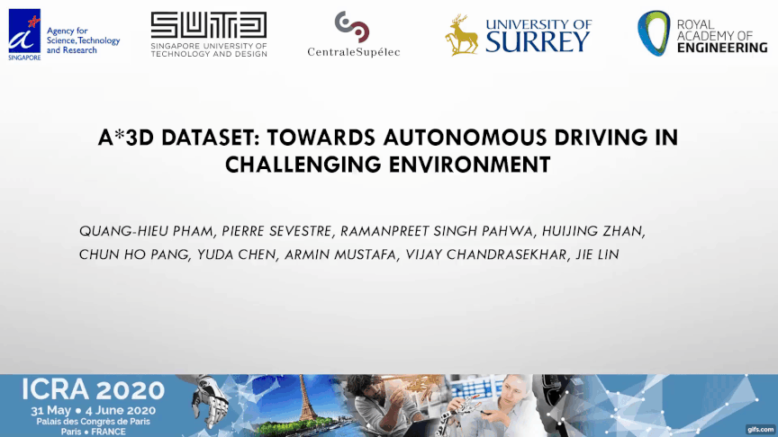

<div align="center">
	
### A*3D: An Autonomous Driving Dataset in Challeging Environments

[Quang-Hieu Pham](https://pqhieu.github.io/) &nbsp;&nbsp;&nbsp; Pierre Sevestre &nbsp;&nbsp;&nbsp; [Ramanpreet Singh Pahwa](https://scholar.google.com.sg/citations?user=4WnuaPsAAAAJ&hl=en) &nbsp;&nbsp;&nbsp; Huijing Zhan &nbsp;&nbsp;&nbsp; Chun Ho Pang Liu &nbsp;&nbsp;&nbsp; Yuda Chen &nbsp;&nbsp;&nbsp; [Armin Mustafa](https://arminmustafa.github.io/) &nbsp;&nbsp;&nbsp; [Vijay Chandrasekhar](http://vijaychan.github.io/) &nbsp;&nbsp;&nbsp; [Jie Lin](https://scholar.google.com.sg/citations?user=bzhI8wcAAAAJ&hl=en) &nbsp;&nbsp;&nbsp;

 ### [Introduction](#introduction) | [News](#news) | [Video Demonstration](#Video-Demonstration) | [Dataset](#Dataset) | [Benchmarking](#benchmarking) | [Download](#Download) 
</div>

## Introduction
A*3D dataset is a step forward to make autonomous driving safer for pedestrians and the public in the real world.

- **230K** human-labeled 3D object annotations in **39,179** LiDAR point cloud frames and corresponding frontal-facing RGB images.
- Captured at different times (day, night) and weathers (sun, cloud, rain).

<div align=center></div>

<div align="center">


[**Paper on arXiv => "A*3D: An Autonomous Driving Dataset in Challeging Environments"**](https://arxiv.org/abs/1909.07541)
</div>

[comment]: <> (Night-time high-density examples from the proposed A*3D dataset with RGB images and their corresponding LiDAR data.)

## News
- [**Oct 04, 2019**] Note: The ground-truth annotations for test set (**1,500** frames) are not released. We encourage you to send us the detection predications on test set for our evaluation, we can post your results on leaderboard with your consent. Will update the evaluation protocol and format shortly.
- [**Oct 04, 2019**] A*3D is ready for download. To get the dataset, please follow the instructions at [Download](#Download). Currently, we only release the full set with 1 LiDAR and 1 camera data. We will add data for the other camera later.
- [**Sep 27, 2019**] We received many requests for download link of A*3D. Still need some time to fix remaining issues like masking out face/license plate, cleaning up the data, finalizing data format, and of course preparing a non-commercial use agreement for signing. It would not take too long (1-2 more weeks), will keep you posted once the data is ready.
- [**Sep 23, 2019**] A*3D is featured on Import AI, one of the Must-Read AI Newsletters by Open AI’s Jack Clark. See [Here](https://us13.campaign-archive.com/?u=67bd06787e84d73db24fb0aa5&id=6e272cb19a).

[comment]: <> (The following demonstrates the comparison with existing multi-modal Autonomous Driving datasets.)

## Video Demonstration

Click the following .gif for full-version video !

[](https://www.youtube.com/watch?v=9LjFbnIvzwg)

## Dataset 
#### Sensor Setup
We collect raw sensor data using the A*STAR autonomous vehicle, which is equipped with the following sensors:
  - Two PointGrey Chameleon3 USB3 Global shutter color cameras (CM3-U3-31S4C-CS) with 55Hz frame rate, 2048 × 1536 resolution.
  - A Velodyne HDL-64ES3 3D-LiDAR with 10Hz spinrate, 64 laser beams.
  
The following depicts the Sensor setup for A*3D data collection vehicle platform. 
  <div align=center></div>
  
#### Data Collection
- The data collection covers **the entire Singapore** including highways, neighborhood roads, tunnels, urban, suburban, industrial, HDB car parks, coastline, etc. 
- NuScenes only covers a small portion of Singapore roads (highlighted in red).

  <div align=center></div>

#### Dataset Statistics
- **17% frames with high object-density**. 
	- The number of annotations per frame for A*3D dataset are much **higher than KITTI dataset**.
	- The A*3D dataset comprises **7 annotated classes** corresponding to the most common objects in road scenes.

<div align=center></div>

- **25% frames with heavy occlusion**. 
	- About half of the vehicles are partially or highly occluded.
	<div align=center></div>

	- Average number of points inside the bounding box of each class and the Log number of points within bounding box.
  	<div align=center></div>
	
- Radial distance.
  	<div align=center></div>

- Distribution of object orientation.
  	<div align=center></div>

- Box dimensions.
  	<div align=center></div>


## Benchmarking
- Object-density: Cross-dataset Evaluation
  - A pre-trained model of PointRCNN on KITTI suffers almost a 15% drop in mAP on A*3D validation set. 
  - When trained on our high-density subset, PointRCNN achieves much better performance on the KITTI validation set, especially on Moderate and Hard with almost 10% improvements.
   <div align=center></div>
   
- High object-density vs. Low object-density
  - When increasing the training data, the performance improvements are marginal.
  - The best result comes from mixing high and low density samples.
    <div align=center></div>

- Day-time vs. Night-time
  - We are the first to provide a systematic study on the effects of night-time on 3D object detection systems with F-PointNet and AVOD methods. 
    <div align=center></div>

## Download

Please email astar3dteam@a3d.page for the download link to the dataset.

-Note: Please include keyword "A*3D" in the title of the email, just in case we overlook it.

-Note: This dataset is for non-commercial research purposes only. A [Non-Commercial Use Agreement](https://github.com/I2RDL2/ASTAR-3D/blob/master/Use%20Agreement.pdf) needs to be signed with handwritten signature. Please attach a signed copy in the email.


## Citation
If using our data in your research work, please cite the following paper:
```
@article{astar-3d,
	author = {Quang-Hieu Pham, Pierre Sevestre, Ramanpreet Singh Pahwa, Huijing Zhan, Chun Ho Pang, Yuda Chen, Armin Mustafa, Vijay Chandrasekhar, Jie Lin},
	title = {A*3D Dataset: Towards Autonomous Driving in Challenging Environments},  
	year = {2019},
	eprint = {1909.07541}
}
```
